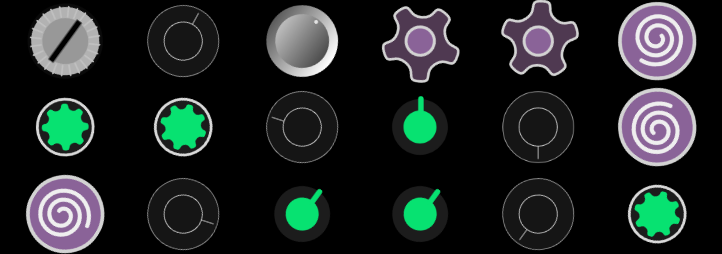

# exponent-ts
A nice UI library, extending Component.ts for use in [OpenBF](https://github.com/openbf-project)
## Implemented Components
 - Grid
 - Button
 - DualPanel - render two elements using a ratio
 - ContextPanel - render a single element out of many, switching using string IDs
 - ImagePanel
 - Knob (mostly) - a rotation based input with configurable turn and value bounds
 - OverlayPanel - useful for rendering GUI on top a canvas
 - Panel - regular panel
 - SquarePanel (partial) - content is always a square that takes up the max available space
 - Drawing - canvas component w/ built in auto-resize, render loop, render passes, helper methods

## Planned Components
 - List
 - Paged List (for large lists)
 - Toggle Button
 - Number
 - Multi-select
 - Slider

## Planned features
 - Track object properties

## Visuals

